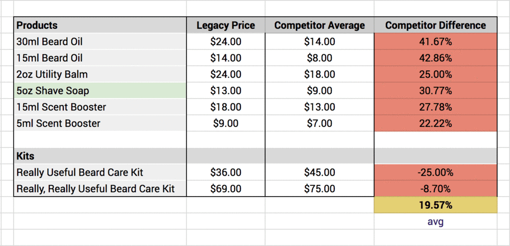
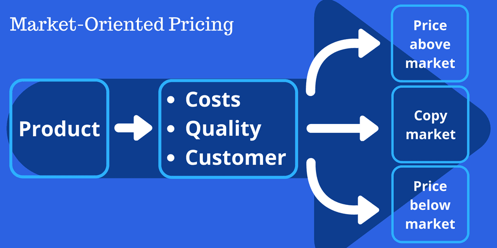
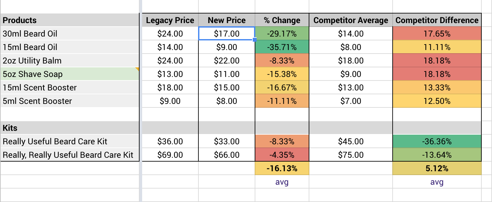

We want as many men as possible to have access to quality skin moisturizer, the right healing balm, or even the perfect toothpaste - and still have money left over for all the other things in life - like seeing their favorite [Gypsy Punk](https://www.instagram.com/p/BDI120Px3iB/) band.

##We promise to be honest with you, always.

It may sound obvious but in an industry saturated with misleading labels, magic potions, and fine print we're committed to giving you honest recommendations with the most beneficial - and organic - ingredients for an affordable price. And, that's what we're really passionate about.

##To be honest, it’s time we lower our prices.

Put simply, after revisiting our costs - what it takes to make, package, and sell our products - we found we could lower our prices, still offer the same high quality organic products, and have enough room to grow, innovate, and give-back.

Lowering our prices opens the doors to launch new organic products that we all use and helps drive those prices down, too. After all, we’re in this together.

##Why we lowered our prices.

This all started when we realized more men could continue, or begin, their self care journey if we simply lowered our prices.

We began by getting a better understanding of common pricing in our industry. We also expanded the definition of the industry we believe we’re in.

Instead of simply comparing our prices to other beard care products, we also looked at other organic and non-organic men’s cosmetics brands like Badger’s, Art Naturals, BeardBrand, Scotch Porter, Bearded Bastard, and roughly 85 other companies within our comparative price range.

This is what we came up with.

<small>On average, our products cost almost 20% more than the industry average.</small>

As you can see, especially with the wider scope of competitors, our prices were almost 20% higher than the industry average. Plenty of room to lower prices without compromising the quality and integrity of our beneficial ingredients, organic products, and impactful brand.

##How we lowered our prices.

Now that we had an understanding of how our prices compared to the beard and men’s cosmetic industries, we were faced with three choices: price above the market, copy the market, or price below the market.

<small>Graphic courtesy of <a href="https://sumo.com/stories/how-to-price-a-product?ref=organicman" target="_blank">How To Price A Product: A Scientific 3-Step Guide (With Calculator)</a> by <a href="https://sumo.com?ref=organicman" target="_blank">Sumo</a></small>

Each of these strategies has its pros and cons.

+ **Price above market:** Consciously pricing your product above the competition to brand yourself as having a higher-quality or better-performing item.
+ **Copy market:** Selling your item at the same price as your competition to maximize profit while staying competitive.
+ **Price below market:** Using data as a benchmark and consciously pricing a product below competitors, to lure customers into your store over theirs.

> 💡 Learn more about market-orientated pricing in <a href="https://sumo.com/stories/how-to-price-a-product?ref=organicman" target="_blank">this</a> blog post.

We knew a few things were set in stone when it came to our ingredients and products:

1. We will always be deliberate in our ingredient selection - from ingredient quality to supply chain to environmental impact.
1. We want as many men as possible to enjoy a beneficial self care journey.

To achieve those things, our prices need to sit between the high quality *Price above market* option and the affordable *Copy market* option.

##Prices built for the future.

We had an idea what our prices should look like, but our work wasn’t done yet.

Our goal is to grow alongside you. Not just today, but well into the future. So, we analyzed our business costs ensuring enough room for things like give backs, raw materials costs, salaries, and innovation.

Then, we really began to crunch the numbers.

This is what we came up with.

<small>Overall, we lowered prices by an average of 16.13% - some as much as 35.71%</small>

We found we could lower our prices by more than 16% - **some as much as 35%** - which also lowered our Competitive Difference to 5% - that’s nearly a 15% decrease!

##Same self care. Just a lower price.

Our products haven’t changed a bit. The only difference is the prices are lower.

With a lower price, and the same high quality organic ingredients, more men can begin, or continue, a better self care journey.

And because we know that most men need a good self care journey and that men who have bought these products in the past are pleased, we believe that more people will buy them with a lower price.

To get you started on your self care journey, we want to lower the price even more for you. 

<a href="https://store.organicman.eco/products/aromacare-beard-care-kit" class="button button-cta secondary-btn is-large">Begin Your Self Care Journey</a>

<h3 style="text-align: center;">☝️☝️️☝️️☝️</h3>

<small><strong>Get 50% off your first beard care kit</strong> when you begin your self care journey</small>
